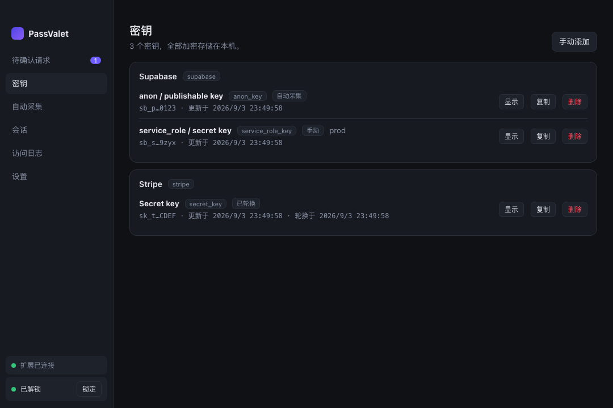
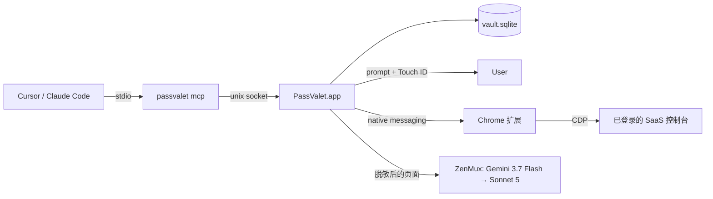

# PassValet

**源码可见，使用需购买商业授权。本项目不是 OSI 认可的开源项目。**

你可以阅读、下载源码用于查看与静态检查；编译、运行、测试、自用、自建服务、公司内部使用、修改或再分发，均须先取得另行购买的书面商业许可。没有个人、非商业或试用免费的默认授权。详见 [LICENSE](LICENSE)。购买授权请联系[仓库所有者](https://github.com/sol1560)，不要在公开 issue 中提交密钥或付款资料。

第三方组件保留原许可证，尤其是 `crates/tauri-plugin-macos-passkey` 的 MIT/Apache-2.0 许可；新条款不追溯取消以前已有效授予的权利，也不限制 GitHub 服务条款允许的查看和 fork。

给 vibe coder 和 AI coding agent 用的密钥管家：在你自己的浏览器里自动从 SaaS 控制台抓取 API key，加密存在本机，
按 session 分发给 agent（MCP / CLI），一次 Touch ID / passkey 授权，key 失效时自动回控制台轮换。

**当前版本仍在验收，自动轮换已暂停。** 现有通用浏览器点击工具无法保证先保存新密钥、再只撤销对应的旧密钥，因此轮换请求会明确失败，不会交给模型执行。下文轮换说明是待完成的目标，不是当前可用能力。七个服务的真实账号、真实 Touch ID / Passkey 和 Apple 签名公证也尚未完成验收；Actions 测试包不是可直接信任的正式发行版。



## 组成

| 目录 | 内容 |
| --- | --- |
| `apps/desktop` | Tauri 2 桌面 app：加密保险库、授权弹窗、解锁（Touch ID / 原生 passkey PRF）、采集 agent、管理面板 |
| `apps/extension` | Chrome MV3 扩展：用 `chrome.debugger` 在你已登录的标签页里执行浏览操作，`capture_secret` 在本地读取 key |
| `crates/passvalet-cli` | 单一二进制 `passvalet`：`mcp`（MCP server）、`init` / `inject`（写 .env）、native-messaging host |
| `crates/passvalet-core` | 保险库：XChaCha20-Poly1305 + 每条 secret 独立 DEK、SQLite、session token、审计日志 |
| `crates/passvalet-ipc` | app ↔ CLI/MCP/扩展 之间的 Unix socket JSON-RPC |
| `crates/passvalet-agent` | 模型无关的浏览器工具集、LLM provider（OpenAI-compat / Anthropic）、模型阶梯、脱敏、剧本 |
| `crates/tauri-plugin-macos-passkey` | vendored 的 macOS passkey(PRF) + LocalAuthentication 桥接 |
| `playbooks/` | Supabase / Stripe / OpenAI / Anthropic / Vercel / Cloudflare / GitHub 的采集与轮换剧本（TOML） |



## 快速开始

```bash
pnpm install
scripts/build-release.sh          # 产出 target/release/bundle/macos/PassValet.app 与 dmg、扩展 zip
cp -R target/release/bundle/macos/PassValet.app /Applications/
open /Applications/PassValet.app  # 首次：选择解锁方式，抄下恢复密钥
```

1. **模型**：设置 → 模型，填 ZenMux API key（存进保险库），默认 `google/gemini-3.7-flash`，失败自动升级 `anthropic/claude-sonnet-5`。
2. **扩展**：Chrome `chrome://extensions` → 开发者模式 → 加载 `apps/extension/.output/chrome-mv3`；把扩展 ID 填到设置 → 浏览器扩展 → 注册。
3. **Agent**：`scripts/install-mcp.sh` 把 `passvalet mcp` 写进 Cursor / Claude Code / Codex 配置；或在设置页复制片段。
4. 在 Cursor 里让 agent 开始一个项目——它会调用 `request_permissions`，PassValet 弹窗，你按一次 Touch ID。

传统工作流：

```bash
cd my-project
passvalet init            # 从 .env.example 推断需要的 key，生成 .passvalet.json
passvalet inject          # 弹窗确认后写入 .env.local
```

## MCP 工具

| 工具 | 说明 |
| --- | --- |
| `request_permissions` | 声明本次任务要用的 key（service + key_type + access），用户批准后得到 session token（MCP 内部保存） |
| `get_key` | 取一个已授权的 key；未在 manifest 内 → `not_granted`，需重新申请 |
| `report_key_invalid` | 报告 401/403；用户批准后 PassValet 在浏览器里创建新 key、撤销旧 key，返回新值 |
| `list_services` | 已知服务、key 类型、env 变量名，以及保险库里已有哪些 |
| `vault_status` | app 是否运行、是否解锁、扩展是否连接 |

## 安全模型

- key 只存本机 `~/Library/Application Support/PassValet/vault.sqlite`，每条 secret 有独立 DEK，DEK 用 KEK 包裹；KEK 在解锁期间只存在内存。
- KEK 来源二选一：Touch ID + 钥匙串（随机 KEK 存登录钥匙串），或原生 passkey 的 PRF 输出经 HKDF 派生（见 `docs/passkey-setup.md`）。
- 任何授权都需一次用户在场验证；session token 有过期时间，撤销后立即失效。
- 自动采集不向模型发送网页截图；模型使用页面文字和控件引用，无法识别控件时需用户协助。已识别的密钥格式在扩展和应用两处遮盖，但规则匹配不能保证识别所有敏感文字。捕获的 key 由扩展直接送入保险库，不作为工具结果发送给模型。
- 采集结束后清空引用与剪贴板钩子，对话历史随 run 结束丢弃；失败或部分完成时保留标签页供用户处理。
- 每次读取写审计日志：谁、何时、哪个 key。

## 开发

```bash
scripts/dev.sh --sandbox     # 数据放 /tmp/passvalet-dev，debug 构建里跳过 Touch ID
cargo test --workspace       # 单元测试
ZENMUX_API_KEY=... cargo test -p passvalet-agent --test live_providers -- --ignored   # 模型连通性
```

调试钩子（仅 debug 构建 + `PASSVALET_DEV_SKIP_PRESENCE=1`）：socket 上的 `dev.setup` / `dev.unlock` / `dev.add_secret` / `dev.decide`，
用于端到端自动化，发布版不存在。

## 还没做的（v1 范围外）

云同步、多设备、proxy 模式 / API 级权限、团队协作、Windows / Linux。签名与公证需要 Apple Developer 账号：
在 `scripts/build-release.sh` 里设置 `APPLE_SIGNING_IDENTITY` 等环境变量。
